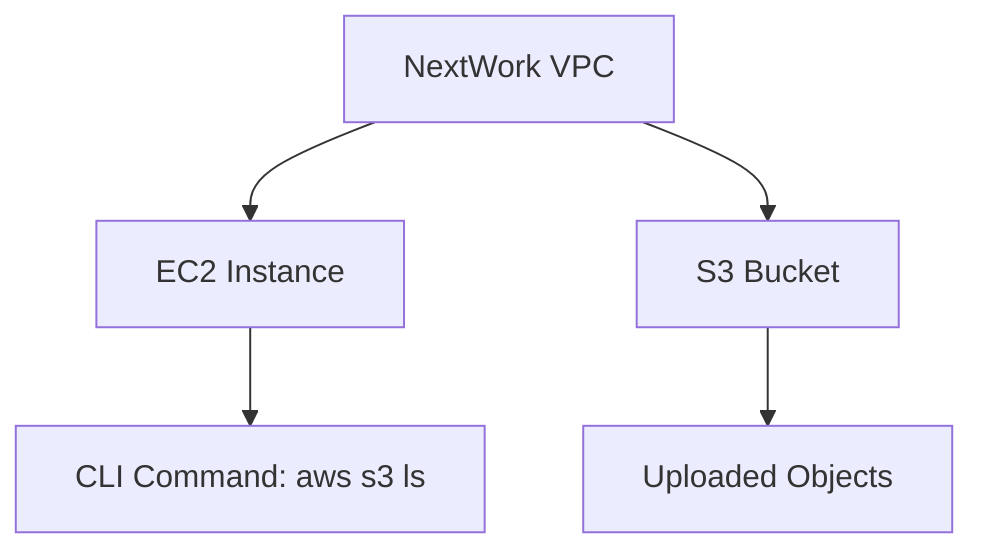
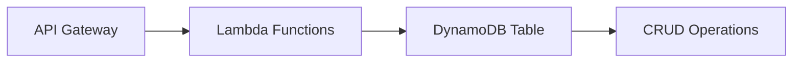
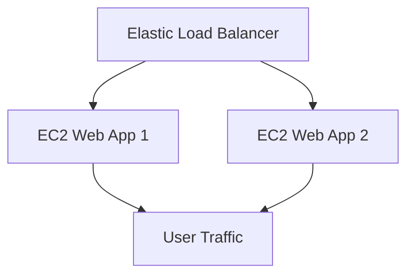
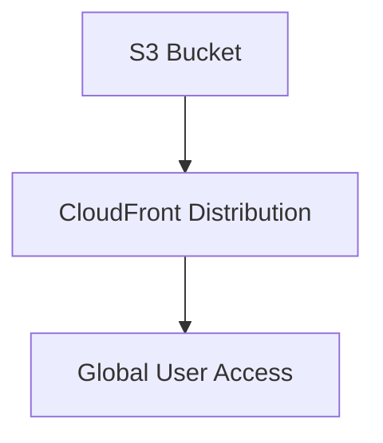
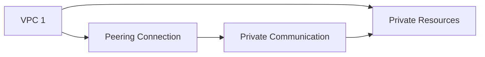

# AWS-PROECTS-LANDING-PAGE

# 🌟 **Welcome to My AWS Projects Showcase!** 🌟

---

## 🌐 **Explore My AWS Journey** 🚀

Welcome to my AWS project landing page! Here, I highlight the exciting work I’ve done with Amazon Web Services (AWS), including **EC2**, **VPC**, **S3**, **Lambda**, **DynamoDB**, and much more! Each project is designed to enhance cloud capabilities, improve scalability, and ensure robust security. Check out the projects below, and discover how I’ve utilized AWS services in real-world scenarios.

---

## 🚀 **Projects Overview** 🔍

Here’s a quick snapshot of my AWS projects. Explore the details of each one below:

1. **[AWS Access S3 from a VPC](#aws-access-s3-from-a-vpc)**
2. **[Serverless Lambda & DynamoDB CRUD Operations](#serverless-lambda-dynamodb-crud-operations)**
3. **[EC2 Web App Deployment with Load Balancer](#ec2-web-app-deployment-with-load-balancer)**
4. **[S3 Static Website Hosting](#s3-static-website-hosting)**
5. **[VPC Peering & Private Network Communication](#vpc-peering-private-network-communication)**

---

## 🖥️ **1. AWS Access S3 from a VPC** 📦

In this project, I demonstrated how to securely access an **S3 bucket** from within a **VPC** using **EC2**. By leveraging AWS CLI and proper access keys, I ensured controlled access to AWS resources.

### 📈 **Key Features:**
- VPC setup with public subnets
- EC2 instance with public IP and SSH access
- Secure S3 bucket access through AWS CLI



## 🛠 2. Serverless Lambda & DynamoDB CRUD Operations 🔥
This project explores how to implement a serverless architecture using AWS Lambda and DynamoDB for CRUD operations. No EC2 instances required—just Lambda functions, DynamoDB, and API Gateway.

## 📈 Key Features:
CRUD operations via AWS Lambda
Data storage in DynamoDB
API Gateway for serverless API access


## 🌍 3. EC2 Web App Deployment with Load Balancer 🌐
In this project, I deployed a web app on EC2 instances behind an Elastic Load Balancer (ELB). This setup ensures scalability and high availability for the web app.

## 📈 Key Features:
EC2 web app deployment
Load Balancer for traffic distribution
Auto-scaling for high availability


## 🌐 4. S3 Static Website Hosting 🌟
I explored hosting a static website on S3 using bucket policies and CloudFront to serve content securely. A simple and scalable solution for hosting static sites.

## 📈 Key Features:
Static website hosted on S3
CloudFront for global content delivery
Simple configuration for scalability




## 🔐 5. VPC Peering & Private Network Communication 🌍
In this project, I set up VPC peering to enable secure and private communication between two VPCs in the same or different regions.

## 📈 Key Features:
VPC Peering for secure network communication
No public internet access
Encrypted communication across private networks


## 💡 Why AWS?
Scalability: AWS services scale automatically with your needs.
Security: With tools like IAM, VPC, and encryption, your applications are safe and secure.
Cost-Effective: Pay-as-you-go pricing ensures you only pay for what you use.
🔍 Learn More 🧠
Feel free to dive deeper into each project for step-by-step instructions, code snippets, and more. If you're interested in collaborating or have any questions, Contact Me! Let’s explore the cloud together! 🌥

## 💬 Get in Touch 📬

LinkedIn: @BrianKimemia
GitHub: briankimemia
Website: briankimemia.vercel.app
## 🔧 Tools & Technologies Used:
Amazon EC2 (Elastic Compute Cloud)
Amazon S3 (Simple Storage Service)
AWS Lambda
Amazon VPC (Virtual Private Cloud)
Amazon DynamoDB
Elastic Load Balancer (ELB)
AWS CloudFormation
AWS CLI
## ✨ Conclusion
Thanks for exploring my AWS projects! With each project, I’ve gained deeper insights into cloud infrastructure, serverless architecture, and secure networking. AWS is a powerful platform that empowers developers to build scalable and resilient solutions.

Let’s build the future of cloud computing together! 🚀🌟

```vbnet
### Features of the Landing Page:

1. **Engaging Colors & Interactive Flowcharts**: The Mermaid.js flowcharts provide visual representation of how AWS services connect in each project.
2. **Project Overview**: Easy navigation with clickable links to each project.
3. **Project Summaries**: Each project description includes key features and a creative, simple diagram showing relationships between AWS services.
4. **Tools & Technologies**: A section dedicated to the AWS tools and services used in your projects.
5. **Contact Information & Social Links**: A way for others to connect with you directly.

This layout is designed to be visually attractive, highly interactive, and well-organized, encouraging others to explore your AWS expertise in an engaging manner.
